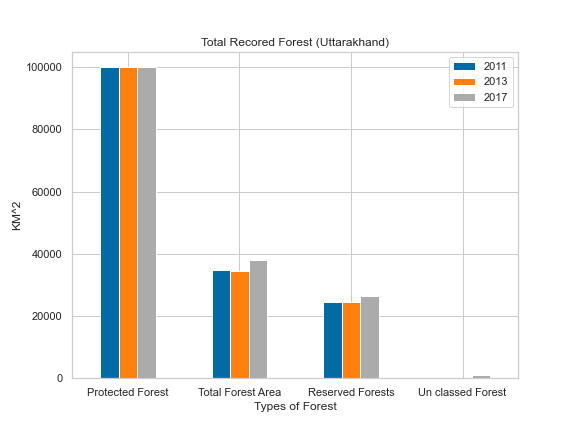
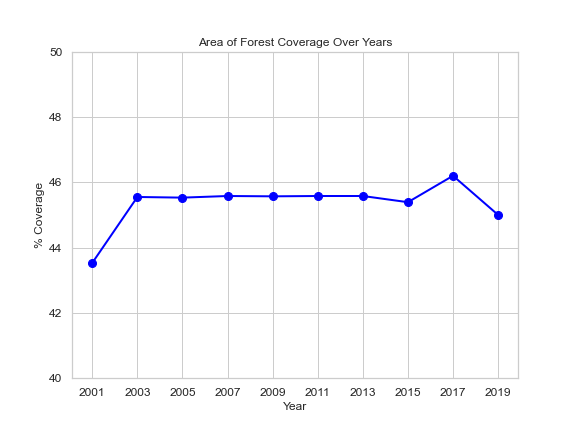
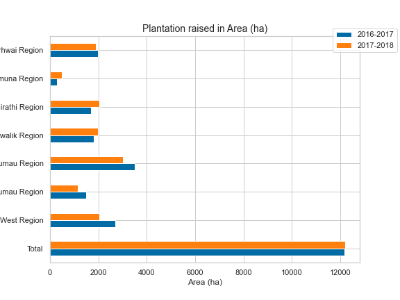
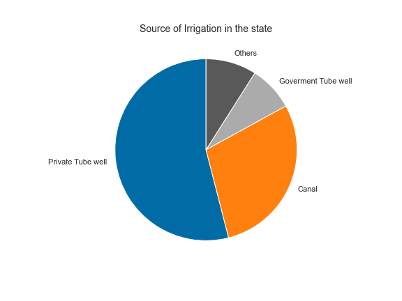

# Data-visualization

Welcome to the Data-visualization repository! 📊 Here, I showcase a collection of visualizations created during my journey of modeling and statistical analysis. Each PNG file represents a unique insight, demonstrating the power of data visualization in conveying complex information.

🚀 As I continue to learn and explore new techniques, this repository evolves with fresh visualizations. Whether you're interested in machine learning, statistical analysis, or simply appreciate the art of data storytelling, you'll find something here.

Feel free to explore the images and witness the transformation of raw data into meaningful insights. If you have any questions, suggestions, or if you'd like to collaborate, don't hesitate to reach out! 

Happy visualizing! 📈✨

### Time-Series visulation

#### Before smoothening

#### After smoothening 

### Scatter Plots visulation

### Bar Graph

### Line Graph

### Horizontal Bar Graph

### PIE Graph

